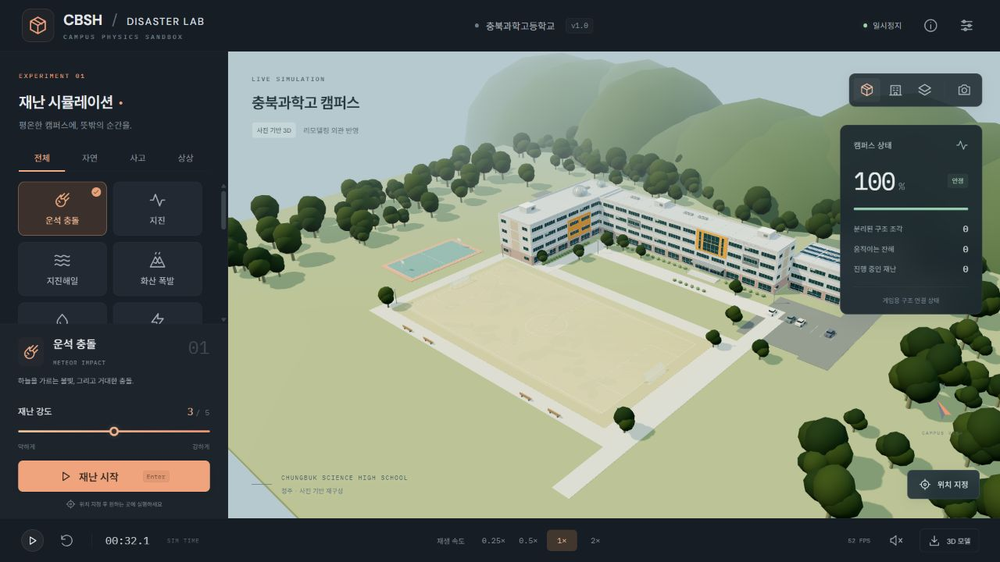

# CBSH · Disaster Lab

충북과학고등학교의 리모델링 외관을 사진으로 재구성한 **브라우저 3D 재난 샌드박스**예요. 운동장과 주변 시설을 둘러보고, 재난의 강도와 위치를 정해 건물이 파손되는 과정을 관찰할 수 있어요.



## 실행

Node.js 24 LTS를 설치한 뒤 프로젝트 폴더에서 실행하세요.

```sh
npm ci
npm run dev
```

터미널에 표시되는 로컬 주소를 브라우저에서 열면 돼요. 기본 주소는 `http://127.0.0.1:5173`예요. 별도 서버나 API 키는 필요하지 않아요. Chrome 또는 Edge의 WebGL 지원 환경을 권장해요.

```sh
npm test            # 물리·재난 동작 검증
npm run build       # 배포용 dist 폴더 생성
npm run preview     # 배포용 결과 확인
npm run export:model # 온전한 캠퍼스 GLB·지지 관계 JSON 재생성
```

`dist` 폴더는 정적 웹 호스팅에 올릴 수 있어요. 상대 경로를 사용하므로 저장소 하위 경로에서도 실행할 수 있어요. 저장소의 GitHub Actions는 변경 시 테스트와 빌드를 수행하고 빌드 결과를 첨부해요.

## 조작

| 동작 | 조작 |
| --- | --- |
| 카메라 회전 | 왼쪽 마우스 드래그 / 손가락 하나 |
| 카메라 이동 | 오른쪽 마우스 드래그 / 손가락 둘 |
| 확대·축소 | 마우스 휠 / 핀치 |
| 재난 실행 | 재난 선택 → 강도 조절 → 재난 시작 / Enter |
| 발생 위치 변경 | 위치 지정 버튼 → 건물 또는 운동장 클릭 |
| 일시정지·재생 | 아래쪽 재생 버튼 / Space |
| 캠퍼스 복구 | 초기화 버튼 / R |
| 슬로 모션 | 0.25×, 0.5×, 1×, 2× |
| 시점 변경 | 전체, 정면, 위에서 보기 |
| 이미지 저장 | 오른쪽 위 카메라 버튼 |
| 현재 모델 저장 | 아래쪽 3D 모델 버튼 |

재난은 최대 4개까지 겹쳐 실행할 수 있어요. 효과음은 처음에는 꺼져 있어요. 설정에서 그림자와 카메라 흔들림을 조절할 수 있고, 작은 화면에서는 아래쪽에 재난 선택 패널이 표시돼요.

## 재난 14종

운석 충돌, 지진, 지진해일, 화산 폭발, 홍수, 낙뢰, 토네이도, 거대 우박, 화재, 폭발 사고, 비행기 추락, 블랙홀, 외계 침공, 중력 반전을 제공해요. 충격, 열, 물, 회전력 등 서로 다른 작용을 조합해요. 블랙홀·외계 침공·중력 반전은 상상 재난이며 물리학적으로 검증된 현상을 재현하지 않아요.

## 3D 모델

- [온전한 캠퍼스 GLB](public/models/cbsh-campus.glb) · Blender 등 GLB 지원 도구에서 가져올 수 있어요.
- [구조 조각과 지지 관계 JSON](public/models/cbsh-structure.json) · 게임에서 작성한 근사 치수와 연결 관계예요.
- [캠퍼스 생성 코드](src/campus.ts) · 창문, 돔, 외벽, 운동장과 주변 지형을 절차적으로 만들어요.

캠퍼스에는 **673개 물리 부재**가 있어요. 이 중 전면 유리창 84개는 벽에서 독립적으로 분리돼요. 창틀과 옥상 장식은 소속 구조물과 함께 움직여요. 지형·나무·차량 등 주변 장식은 정적 배경이에요.

제공 GLB는 원본 상태를 저장한 파일이에요. 화면의 3D 모델 버튼은 **현재 파손 상태**를 저장하므로, 온전한 모델을 받고 싶으면 먼저 초기화하세요. 브라우저에서 생성한 학교 이름 간판은 화면 내보내기에 포함되고, Node로 만든 기본 GLB에는 이 텍스처가 생략돼요. Unity에서는 GLB를 지원하는 가져오기 패키지가 필요해요.

## 정확도와 범위

회색 외벽, 주황색 강조부, 왼쪽 옥상의 천문대 돔 두 개, 꺾인 본동과 전면 잔디 공간은 제공 사진을 바탕으로 만들었어요. 사진에 없는 뒷면, 별동 배치, 운동장의 상세 형태와 치수는 추정이에요. **2023년 현대화사업 이후 외관을 참고한 게임용 재구성**이며, 2026년의 모든 변경을 현장에서 확인한 실측 모델은 아니에요.

중력·질량·충돌·마찰은 Rapier 강체 엔진으로 계산해요. 파괴 임계값, 지지 관계, 열에 의한 약화와 수류는 게임용 근사 모델이에요. 건물 내부 설계도, 실제 재료 강도, 철근 배치나 지반 데이터는 사용하지 않았어요. 실제 학교의 구조 안전성이나 피해를 예측할 수 없어요.

[참고자료와 추정 범위](docs/references.md), [물리 구현과 제한](docs/physics.md)에 자세히 기록했어요.

## 구성

| 파일 | 역할 |
| --- | --- |
| `src/campus.ts` | 학교·운동장·조경과 지지 관계 생성 |
| `src/physics.ts` | Rapier 강체, 손상, 붕괴, 열, 수류 |
| `src/disasters.ts` | 14종 재난, 입자와 시각 효과 |
| `src/main.ts` | 카메라, 입력, 화면, 실행 제어, 내보내기 |
| `tests/` | 물리·재난·캠퍼스 통합 검사 |

Three.js, Rapier, Vite, TypeScript를 사용해요. 외부 사진을 게임 텍스처로 배포하지 않아요. Google Fonts 연결이 없어도 시스템 글꼴로 실행돼요.
