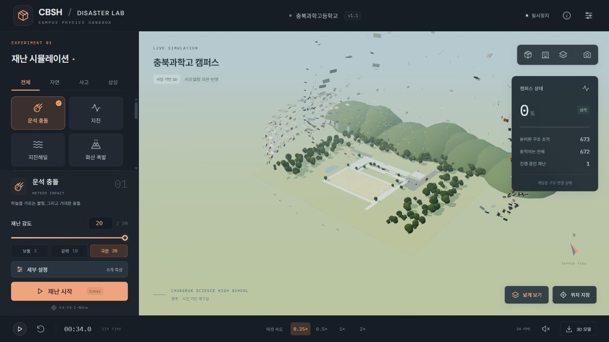
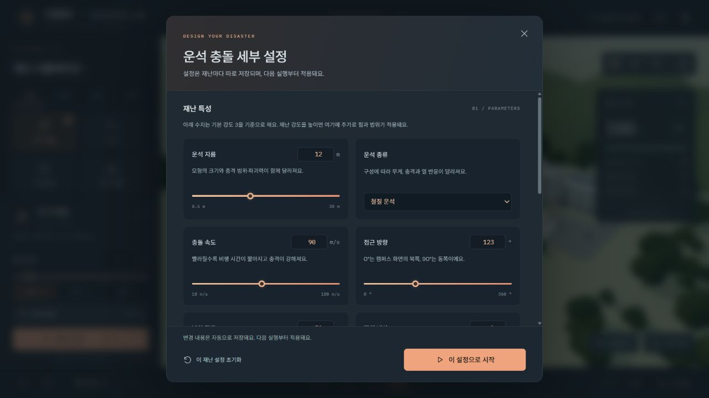

# CBSH · Disaster Lab

충북과학고등학교의 리모델링 외관을 사진으로 재구성한 **브라우저 3D 재난 샌드박스**예요. 운동장과 주변 시설을 둘러보고, 재난의 강도와 위치를 정해 건물이 파손되는 과정을 관찰할 수 있어요.


## 실행

Node.js 24 LTS를 설치한 뒤 프로젝트 폴더에서 실행하세요.

```sh
npm ci
npm run dev
```

터미널에 표시되는 로컬 주소를 브라우저에서 열면 돼요. 기본 주소는 `http://127.0.0.1:5173`예요. 별도 서버나 API 키는 필요하지 않아요. Chrome 또는 Edge의 WebGL 지원 환경을 권장해요.

```sh
npm test            # 물리·재난 동작 검증
npm run build       # 배포용 dist 폴더 생성
npm run preview     # 배포용 결과 확인
npm run export:model # 온전한 캠퍼스 GLB·지지 관계 JSON 재생성
```

`dist` 폴더는 정적 웹 호스팅에 올릴 수 있어요. 상대 경로를 사용하므로 저장소 하위 경로에서도 실행할 수 있어요. 저장소의 GitHub Actions는 변경 시 테스트와 빌드를 수행하고 빌드 결과를 첨부해요.

## 조작

| 동작           | 조작                                                                 |
| -------------- | -------------------------------------------------------------------- |
| 카메라 회전    | 왼쪽 마우스 드래그 / 손가락 하나                                     |
| 카메라 이동    | 오른쪽 마우스 드래그 / 손가락 둘                                     |
| 확대·축소      | 마우스 휠 / 핀치                                                     |
| 재난 실행      | 재난 선택 → 강도 조절 → 재난 시작 / Enter                            |
| 발생 위치 변경 | 위치 지정 버튼 → 건물 또는 운동장 클릭, 또는 세부 설정에서 좌표 입력 |
| 직접 파괴 | 직접 파괴 카테고리 → 유형 선택 → 켜기 → 클릭·드래그. 끄기 또는 Esc로 카메라 복귀 |
| 세부 설정      | 재난 선택 → 세부 설정 → 항목별 슬라이더·숫자·종류 변경               |
| 일시정지·재생  | 아래쪽 재생 버튼 / Space                                             |
| 캠퍼스 복구    | 초기화 버튼 / R                                                      |
| 슬로 모션      | 0.25×, 0.5×, 1×, 2×                                                  |
| 시점 변경      | 전체, 정면, 위에서 보기, 잔해를 멀리서 보는 넓게 보기                |
| 이미지 저장    | 오른쪽 위 카메라 버튼                                                |
| 현재 모델 저장 | 아래쪽 3D 모델 버튼                                                  |

재난은 최대 4개까지 겹쳐 실행할 수 있어요. 효과음은 처음에는 꺼져 있어요. 설정에서 그림자와 카메라 흔들림을 조절할 수 있고, 작은 화면에서는 아래쪽에 재난 선택 패널이 표시돼요.

## 강도와 세부 설정

재난 강도는 **1~10**, 기본값은 **5**예요. 최대 강도에서도 지면에 붙은 기초와 낮은 구조는 폭발에 더 강하게 버티며, 위쪽 구조와 잔해가 먼저 떨어져 나가요. 반복 공격이나 기초 아래의 굴착으로 남은 부분도 무너뜨릴 수 있어요. **0.25×**와 **넓게 보기**를 함께 사용하면 비산 과정을 관찰하기 좋아요.



세부 설정의 크기·속도·열량 등에는 전체 강도가 함께 적용돼요. 예를 들어 큰 철질 운석과 높은 속도, 강도 10을 조합하면 기본 암석 운석보다 훨씬 강해져요. 실제 천체·재난의 수치 예측과는 다른 게임용 조절이에요.

| 재난      | 조절할 수 있는 세부 항목                                           |
| --------- | ------------------------------------------------------------------ |
| 운석      | 지름, 암석·철질·얼음 종류, 속도, 접근 방향, 낙하 각도, 잔해 비산   |
| 지진      | 진동 주파수, 방향, 지속 시간                                       |
| 지진해일  | 높이, 이동 속도, 폭, 방향, 지속 시간                               |
| 화산      | 분출 빈도, 화산탄 지름, 낙하 범위, 열량, 지속 시간                 |
| 홍수      | 최고 수위, 상승 시간, 수류 속도, 방향, 지속 시간                   |
| 낙뢰      | 횟수, 간격, 분산 범위, 방전 열량                                   |
| 토네이도  | 영향 반경, 회전력, 상승력, 이동 거리, 방향, 지속 시간              |
| 우박      | 지름, 빈도, 낙하 범위, 높이, 지속 시간                             |
| 화재      | 초기 범위, 열량, 확산 속도, 바람 세기·방향, 지속 시간              |
| 폭발      | 반경, 사방·상향·방향성 형태, 비산, 후속 열량, 방향                 |
| 비행기    | 제트기·화물기·글라이더 종류, 크기, 속도, 접근 방향·각도, 후속 화재 |
| 블랙홀    | 영향 반경, 핵 크기, 인력, 회전력, 높이, 지속 시간                  |
| 외계 침공 | 비행체 수, 발사 간격, 빔 출력, 공격 범위, 높이, 지속 시간          |
| 중력 반전 | 영향 반경, 상승력, 목표 높이, 회전력, 낙하 관찰 시간, 지속 시간    |

위치가 있는 재난은 직접 지점을 클릭하거나 장면 좌표를 입력할 수 있어요. 지진과 홍수는 캠퍼스 전체에 적용돼요. 재난을 바꾸거나 새로고침해도 각각의 강도·위치·세부 값이 유지되며, 실행 중인 재난에는 실행 버튼을 누른 시점의 값이 고정돼요. 저장은 현재 브라우저의 로컬 저장소를 사용해요.

위치를 직접 정하면 얇은 원형 표시가 선택 지점을 보여주고, 재난을 시작하면 자동으로 사라져요. 직접 파괴는 기존 재난과 독립된 카테고리예요. 물리·연소·부식·융해·변이·수압·중력 왜곡·지면 파기 중 하나를 고르고 범위와 강도를 조절할 수 있어요. 켜진 동안만 클릭·드래그가 파괴에 할당되며, 누르고 있으면 계속 적용돼요. 일시정지 중에는 파괴가 멈춰요.



## 재난 14종

운석 충돌, 지진, 지진해일, 화산 폭발, 홍수, 낙뢰, 토네이도, 거대 우박, 화재, 폭발 사고, 비행기 추락, 블랙홀, 외계 침공, 중력 반전을 제공해요. 충격, 열, 물, 회전력 등 서로 다른 작용을 조합해요. 블랙홀·외계 침공·중력 반전은 상상 재난이며 물리학적으로 검증된 현상을 재현하지 않아요.

운석·폭발·비행기·화산탄·UFO 빔처럼 강한 지면 충격은 충돌 지점의 땅을 실제 높이 아래로 파내요. 지면은 **복셀 밀도장을 Marching Cubes로 표면화**하며, 기존 운동장 표면과 평평한 충돌 바닥도 해당 위치에서 교체해요. 그 결과 잔해가 구덩이 안으로 떨어져 바닥과 경사면에 쌓여요. 화재는 열을 주변 부재로 전달하며, 가연성 지붕·장식·목재는 그을린 뒤 약해져 붕괴해요. 벽과 기둥은 불에 타는 재질로 가정하지 않고 고열 손상과 지지 상실로 파손돼요. 홍수와 지진해일은 즉시 작용하는 수압·부력·유체 저항에 더해 노출 부재의 부식을 천천히 누적해요.

### 재난과 파괴 작용

재난은 시작하는 현상이고, 파괴 작용은 그 현상이 건물에 전달하는 힘이에요. 하나의 재난이 여러 작용을 함께 사용할 수 있어요.

| 파괴 작용 | 적용 재난 | 구현한 반응 |
| --- | --- | --- |
| 충격·파쇄 | 운석, 폭발, 추락, 화산탄, UFO, 우박, 낙뢰 | 거리 감쇠 손상, 지지 손실, 실제 강체 잔해와 충돌 |
| 피로·비틀림 | 지진, 토네이도, 블랙홀 | 가속도·회전력으로 연결부를 약화시킨 뒤 붕괴 |
| 연소·고열 연화 | 화재, 화산, 낙뢰, 추락 후 화재 | 가연 부재의 연소 확산, 비가연 부재의 고열 손상 |
| 수압·부력·유체 항력 | 홍수, 지진해일 | 이동 수면, 흐름 하중, 떠오름과 잔해 이동 |
| 부식 | 홍수, 지진해일 | 젖은 부분에 변색·패임을 누적하고 조각을 흘리며 소실, 지지 손실로 붕괴 |
| 융해 | 화산탄, 직접 파괴 | 고열로 달구고 눌어앉으며 소실 |
| 변이 | UFO, 블랙홀, 직접 파괴 | 비정상적인 색, 뒤틀린 형상과 충돌체, 구조 약화 |
| 지면 변형 | 운석, 폭발, 추락, 화산탄, UFO | 둥근 굴착면과 동일한 충돌 지형 |

## 3D 모델

- [온전한 캠퍼스 GLB](public/models/cbsh-campus.glb) · Blender 등 GLB 지원 도구에서 가져올 수 있어요.
- [구조 조각과 지지 관계 JSON](public/models/cbsh-structure.json) · 게임에서 작성한 근사 치수와 연결 관계예요.
- [캠퍼스 생성 코드](src/campus.ts) · 창문, 돔, 외벽, 운동장과 주변 지형을 절차적으로 만들어요.

캠퍼스에는 **1,662개 물리 부재**가 있어요. 이 중 전면 유리창 84개는 벽에서 독립적으로 분리돼요. 창틀과 옥상 장식은 소속 구조물과 함께 움직여요. 지형·나무·차량 등 주변 장식은 정적 배경이에요.

제공 GLB는 원본 상태를 저장한 파일이에요. 화면의 3D 모델 버튼은 **현재 파손 상태**를 저장하므로, 온전한 모델을 받고 싶으면 먼저 초기화하세요. 브라우저에서 생성한 학교 이름 간판은 화면 내보내기에 포함되고, Node로 만든 기본 GLB에는 이 텍스처가 생략돼요. Unity에서는 GLB를 지원하는 가져오기 패키지가 필요해요.

## 정확도와 범위

회색 외벽, 주황색 강조부, 왼쪽 옥상의 천문대 돔 두 개, 꺾인 본동과 전면 잔디 공간은 제공 사진을 바탕으로 만들었어요. 추가로 제공된 위성사진과 2024년 1월 로드뷰를 참고해 기숙사 두 동, 뒤쪽 창의융합동, 동쪽 테니스장·다목적 코트, 운동장 비율을 반영했어요. 주변 숲과 산, 논밭, 주차 공간도 표현했어요. 세부 치수와 사진에 없는 뒷면·내부 구조는 추정이에요. **2023년 현대화사업 이후 외관을 참고한 게임용 재구성**이며, 2026년의 모든 변경을 현장에서 확인한 실측 모델은 아니에요.

중력·질량·충돌·마찰은 Rapier 강체 엔진으로 계산해요. 파괴 임계값, 지지 관계, 열에 의한 약화와 수류는 게임용 근사 모델이에요. 강한 충격의 분화구는 국소 복셀 밀도장을 깎고 Marching Cubes로 둥근 표면을 추출하며, 낮은 분화구 가장자리 충돌면도 함께 만들어요. 실제 지반의 연속 변형이나 토질 해석은 하지 않아요. 건물 내부 설계도, 실제 재료 강도, 철근 배치나 지반 데이터는 사용하지 않았어요. 실제 학교의 구조 안전성이나 피해를 예측할 수 없어요.

[참고자료와 추정 범위](docs/references.md), [물리 구현과 제한](docs/physics.md)에 자세히 기록했어요.

## 구성

| 파일                       | 역할                                    |
| -------------------------- | --------------------------------------- |
| `src/campus.ts`            | 학교·운동장·조경과 지지 관계 생성       |
| `src/physics.ts`           | Rapier 강체, 손상, 붕괴, 열, 수류       |
| `src/disasters.ts`         | 14종 재난, 입자와 시각 효과             |
| `src/disaster-settings.ts` | 재난별 설정, 기본값, 허용 범위          |
| `src/main.ts`              | 카메라, 입력, 화면, 실행 제어, 내보내기 |
| `tests/`                   | 물리·재난·캠퍼스 통합 검사              |

Three.js, Rapier, Vite, TypeScript를 사용해요. 외부 사진을 게임 텍스처로 배포하지 않아요. Google Fonts 연결이 없어도 시스템 글꼴로 실행돼요.

### 최근 품질 개선

화염은 표면에 붙은 큰 다각형 불꽃과 상승하는 연기로 표현해요. 연소·부식으로 소실된 부재는 충돌체도 사라지고, 지지 연결이 약해지면 위 구조가 중력으로 무너져요. 화산은 안쪽으로 파인 분화구와 용암, 분화구에서 출발하는 화산탄을 갖춰요. UFO는 순찰하며 여러 표면을 공격하고 떨어진 잔해를 흡입해요. 쓰나미는 학교 너머까지 이어지며 보이는 파면과 침수·부식 판정을 함께 사용해요.

첨부 자료를 바탕으로 기숙사와 창의융합동 연결, 운동장과 테니스장 배치를 반영했어요. 정적인 주변 풍경과 연기 묶음은 그리기 요청을 합치고, 같은 지면을 반복해서 파는 연산은 생략해요. 굴착은 둥근 수직 구덩이 형태로 근사하며, 동굴·터널·지반 토사 유동은 구현하지 않아요.

파손 먼지는 건물이 분리되거나 잔해가 충돌한 지점에서 옆으로 퍼지며 가라앉고, 약 0.7~1.1초 안에 사라져요. 설정의 **파손 먼지**를 끄면 현재 먼지까지 즉시 지워지며 다음 접속에도 설정이 유지돼요. 불 연기는 이 설정과 별개로 어두운 구름 덩어리가 겹치며 천천히 상승해요.


직접 파괴의 **잡아 옮기기**를 선택하고 켜면 건물 부재나 잔해를 마우스로 잡아 움직일 수 있어요. 화면과 나란한 평면을 따라 물리적인 힘으로 끌며, 놓으면 중력이 적용돼요. 붙어 있는 부재를 잡으면 분리되고 지지하던 구조에도 영향을 줘요. 도구 끄기, Esc, 일시정지, 창을 벗어날 때 잡기가 풀려요.

운석의 후속 화재는 충돌 후 주변에 남은 일부 지붕·목재·부속물에만 생겨요. 빠르게 날아가는 잔해는 발화 대상에서 제외해요. UFO는 물리 파괴와 변이를 사용해요. 불꽃은 높이·폭·기울기가 다르고, 연기는 불투명한 어두운 회색 구체 여러 개가 뭉쳐 크기를 바꾸며 올라가요.

설정의 **지면 굴착**을 끄면 새 구덩이가 생기지 않아요. 이미 생긴 구덩이는 캠퍼스 초기화로 복구해요. 굴착은 실제 아래로 파인 둥근 표면과 충돌 지형을 함께 변경하며 잔해도 그 안으로 떨어져요.
